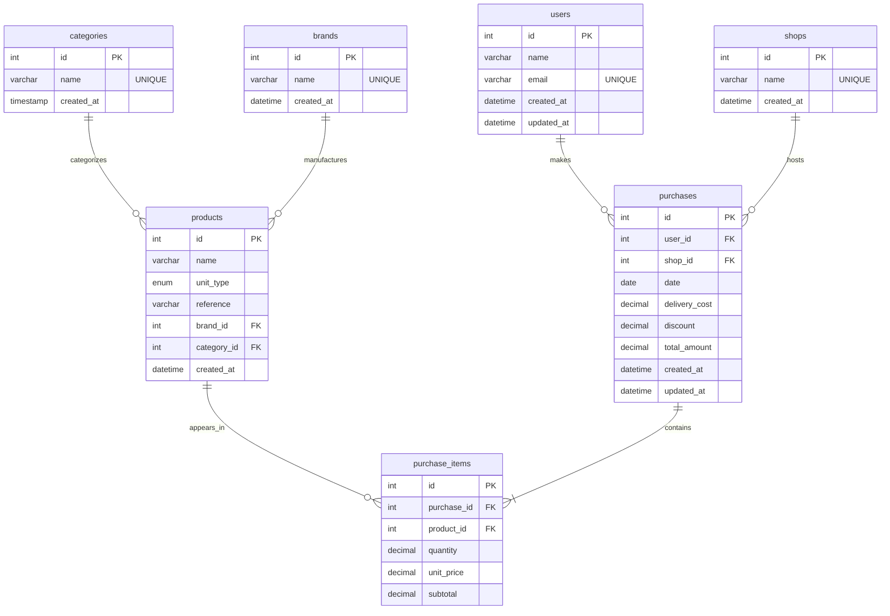

# SmartSpend

> **Personal Expense Intelligence Platform** — Full-stack web application for recording, viewing, and analysing household expenses at the item level. Features a responsive split-screen dashboard, full CRUD management for all entities, searchable/creatable dropdowns powered by `react-select`, and a normalized Snowflake schema designed for Power BI analytics.


---

## Recent Major Updates

### Database Normalization & Power BI Readiness
Refactored the `products` table to replace legacy text-based `category` and `brand` columns with integer Foreign Keys (`category_id → categories.id`, `brand_id → brands.id`). Extracted brand strings into a dedicated `brands` dimension table with `UNIQUE` constraints. This normalization prepares the schema for a clean Snowflake/Star Schema in Power BI, enabling proper slicer filtering and VertiPaq compression.

### ETL Migration from Microsoft Access
Built Python ETL scripts ([import_access_data.py](backend/scripts/data_import/import_access_data.py), [import_orders.py](backend/scripts/data_import/import_orders.py)) to migrate historical household data from a legacy MS Access database into the normalized MySQL schema. Handled Windows `cp1252` encoding, European decimal formats (`€`, commas), date parsing (`dayfirst=True`), and foreign key constraint management during bulk inserts.

### Backend API Expansion
Wrote complete `PUT` (Update) and `DELETE` endpoints for Users, Shops, Products, Categories, and Purchases. Added Pydantic v2 `Update` schemas with `exclude_unset=True` partial-update support. Engineered atomic transaction logic in the Purchases router that automatically deletes all existing `purchase_items` and inserts replacements on edit, with full rollback on validation failure.

### Frontend UI/UX Overhaul
Engineered a responsive split-screen layout: fixed `TransactionForm` on the left, dynamic `DashboardManager` on the right. Built a "Grid Center" main menu with drill-down cards for Users, Shops, Transactions, and a nested Products Hub (Products → Categories → Brands). Replaced basic HTML `<select>` dropdowns with searchable/creatable `react-select` (`CreatableSelect`) components supporting 121+ products with inline category creation. Accurate decimal handling for EUR currency formatting throughout.

### Database Architecture
The MySQL database is structured using a **normalized Snowflake Schema**, ensuring high data integrity for the FastAPI backend and optimized slice-and-dice querying for the Power BI dashboard.

- **Fact Tables (Transactions):** `purchases` (receipt headers) and `purchase_items` (granular line items tracking exact quantities, unit prices, and subtotals).
- **Dimension Tables (Lookups):** `users`, `shops`, `categories`, `brands`, and a central `products` catalog.

*Recent structural updates include extracting legacy brand strings into a dedicated `brands` table, linking them via a `brand_id` foreign key, and enforcing strict `UNIQUE` constraints across all reference tables to eliminate duplicate entries.*

👉 **[View the full Entity-Relationship Diagram (ERD) here](docs/database_erd.md)**

### Analytics & Business Intelligence (Power BI)
A dedicated Power BI analytics layer connects directly to the MySQL database, leveraging the Snowflake schema for fact/dimension modeling. The dashboard includes 23 DAX measures across 6 interactive pages covering executive overview, monthly breakdown, shop comparison, user analysis, category deep-dive, and transaction drill-through.

👉 **[View the full Power BI Report here](powerbi/PowerBiReport.md)**

---

## Project Structure

```
SmartSpend/
├── backend/                        # FastAPI application
│   ├── app/
│   │   ├── core/                   # Configuration & database
│   │   │   ├── config.py           # Pydantic BaseSettings — loads .env automatically
│   │   │   └── database.py         # SQLAlchemy engine, session factory & get_db dependency
│   │   ├── models/                 # SQLAlchemy ORM models (normalized relational schema)
│   │   │   ├── __init__.py         # Barrel export: User, Product, Shop, Category, Brand, Purchase, PurchaseItem
│   │   │   ├── user.py             # User model — household members
│   │   │   ├── shop.py             # Shop model — retail locations / vendors
│   │   │   ├── product.py          # Product model — catalog with category_id & brand_id FKs
│   │   │   ├── category.py         # Category model — product classification dimension
│   │   │   ├── brand.py            # Brand model — product brand dimension
│   │   │   ├── purchase.py         # Purchase model — transaction header (date, shop, user, total)
│   │   │   └── purchase_item.py    # PurchaseItem model — line-items linking Purchase ↔ Product
│   │   ├── schemas/                # Pydantic v2 request/response validation
│   │   │   ├── schemas.py          # Shared / legacy base schemas
│   │   │   ├── user.py             # UserCreate, UserUpdate, UserResponse
│   │   │   ├── shop.py             # ShopCreate, ShopUpdate, ShopResponse
│   │   │   ├── product.py          # ProductCreate, ProductUpdate, ProductResponse
│   │   │   ├── category.py         # CategoryCreate, CategoryUpdate, CategoryResponse
│   │   │   └── purchase.py         # PurchaseCreate, PurchaseUpdate, PurchaseResponse (nested items)
│   │   ├── routers/                # FastAPI route handlers — one per domain entity
│   │   │   ├── users.py            # /users   — full CRUD
│   │   │   ├── shops.py            # /shops   — full CRUD
│   │   │   ├── products.py         # /products — full CRUD
│   │   │   ├── categories.py       # /categories — full CRUD (get-or-create on POST)
│   │   │   └── purchases.py        # /purchases — atomic multi-item transaction CRUD
│   │   └── main.py                 # FastAPI entry point — CORS, router mounting, health checks
│   ├── scripts/
│   │   └── data_import/            # ETL scripts for historical MS Access migration
│   │       ├── import_access_data.py   # Main ETL: products + orders import with FK management
│   │       ├── import_orders.py        # Standalone orders/details CSV import
│   │       ├── raw/                    # Raw CSV exports from Access (cp1252 encoded)
│   │       └── cleaned/               # Cleaned CSVs ready for SQL import
│   ├── .env                        # Environment variables (DB credentials, CORS origins)
│   ├── .env.example                # Template for environment configuration
│   └── requirements.txt            # Python dependencies (FastAPI, SQLAlchemy, pymysql, etc.)
│
├── frontend/                       # React single-page application
│   ├── public/
│   │   └── index.html              # HTML shell
│   ├── src/
│   │   ├── components/
│   │   │   ├── Header.js           # Navigation header
│   │   │   ├── Header.css          # Header styles
│   │   │   ├── TransactionForm.js  # ★ Multi-item purchase form with CreatableSelect dropdowns
│   │   │   ├── TransactionList.js  # Purchase history cards with item-level detail tables
│   │   │   ├── DashboardManager.js # ★ Grid Center — drill-down panels for all entity management
│   │   │   └── DashboardManager.css # Dashboard grid & panel styles
│   │   ├── services/
│   │   │   └── api.js              # Axios HTTP client — all CRUD calls to FastAPI backend
│   │   ├── App.js                  # Root component — split-screen layout
│   │   ├── App.css                 # App-level responsive styles
│   │   ├── index.js                # React DOM entry point
│   │   └── index.css               # Global styles
│   ├── .env                        # Frontend env (REACT_APP_API_URL)
│   └── package.json                # npm dependencies & scripts
│
├── database/                       # SQL schema & migration scripts
│   ├── init.sql                    # Initial database bootstrap
│   ├── 14-02-26-schema.sql         # Full normalized schema with constraints
│   └── fix_schema.sql              # Schema patches / corrections
│
├── docs/                           # Project documentation
│   ├── architecture.md             # High-level architecture overview
│   ├── database_erd.md             # Mermaid Entity-Relationship Diagram
│   ├── ProjectBriefing.md          # Project brief (English)
│   ├── ProjectBriefingES.md        # Project brief (Spanish)
│   ├── ProjectStructure14-02-26.md # Structure snapshot — Feb 14
│   └── ProjectStructure16-02-26.md # Structure snapshot — Feb 16
│
├── powerbi/                        # Power BI reports & documentation
│   ├── PowerBiReport.md            # Comprehensive dashboard report
│   ├── PowerBiDashBordPages.md     # Dashboard pages documentation
│   ├── The Engine Room_ _Measures Dictionary.md  # DAX measures dictionary
│   └── ModelView.md                # Data model documentation
│
├── .gitignore
└── README.md
```

---

## Tech Stack

| Layer      | Technology                         |
| ---------- | ---------------------------------- |
| Backend    | FastAPI (Python 3.11+)             |
| Database   | MySQL 8                            |
| ORM        | SQLAlchemy 2.0                     |
| Frontend   | React 18 (JavaScript)              |
| HTTP       | Axios                              |
| UI Select  | react-select / creatable           |
| Analytics  | Power BI (Integrated / Snowflake Schema) |

---

## Prerequisites

- **Python 3.11+**
- **Node.js 18+** and **npm**
- **MySQL 8** running locally (or a remote instance)

---

## Getting Started

### 1. Clone the repository

```bash
git clone https://github.com/buntynanwani/SmartSpend.git
cd SmartSpend
```

### 2. Set up MySQL

```bash
mysql -u root -p < database/init.sql
```

Edit `backend/.env` with your MySQL credentials:

```
DB_HOST=localhost
DB_PORT=3306
DB_USER=root
DB_PASSWORD=your_password
DB_NAME=smartspend
```

### 3. Setup Backend

```bash
cd backend/
python -m venv venv
source venv/Scripts/activate
pip install -r requirements.txt
```

### 4. Run Backend

```bash
cd backend/
source venv/Scripts/activate
uvicorn app.main:app --reload --port 8000
```

> The interactive API documentation is available at **http://127.0.0.1:8000/docs**

### 5. Run Frontend

```bash
cd frontend/
npm install
npm start
```

App opens at **http://localhost:3000**

---

## Application Architecture
# SmartSpend Database Entity-Relationship Diagram (ERD)

This document visualizes the normalized relational database schema for the SmartSpend application. The schema is designed following a Snowflake architecture, separating transactional data (Facts) from descriptive metadata (Dimensions).

## 📊 Visual ERD (Mermaid)




### Split-Screen Layout

The frontend uses a responsive split-screen design managed by [`App.js`](frontend/src/App.js):

| Panel | Component | Role |
|-------|-----------|------|
| **Left (Fixed)** | [`TransactionForm`](frontend/src/components/TransactionForm.js) | Multi-item purchase entry with `CreatableSelect` dropdowns for users, shops, products, and categories. Supports both create and edit modes. |
| **Right (Dynamic)** | [`DashboardManager`](frontend/src/components/DashboardManager.js) | Grid Center main menu with drill-down panels for entity management. |

### Grid Center Navigation

The [`DashboardManager`](frontend/src/components/DashboardManager.js) renders a card-based grid menu that navigates to dedicated management panels:

| Card | Panel | Features |
|------|-------|----------|
| 👥 **Users** | `UsersPanel` | Full CRUD — inline add/edit form, delete with confirmation |
| 🏪 **Shops** | `ShopsPanel` | Full CRUD — inline add/edit form, delete with confirmation |
| 💳 **Transactions** | `TransactionsPanel` | Browse all purchases via [`TransactionList`](frontend/src/components/TransactionList.js), edit triggers `TransactionForm` pre-population |
| 📦 **Edit Products** | `ProductsGridMenu` | Nested sub-grid with three drill-down cards: |
| | → 📋 All Products | `ProductsManagePanel` — searchable product list with `CreatableSelect` category assignment |
| | → 🏷️ Categories | `CategoriesManagePanel` — full CRUD for product categories |
| | → 🔖 Brands | `BrandsManagePanel` — placeholder panel (schema-ready with `brand_id` FK) |

### Data Flow

```
User → React Frontend → Axios API Layer → FastAPI Backend → SQLAlchemy ORM → MySQL Database
                                                                                    ↓
                                                                              Power BI Dashboard
```

### Relational Models

The seven SQLAlchemy models in [`backend/app/models/`](backend/app/models/__init__.py) map directly to the normalized SQL schema:

| Model | File | Table | Description |
|-------|------|-------|-------------|
| `User` | [`user.py`](backend/app/models/user.py) | `users` | Household members who record purchases |
| `Shop` | [`shop.py`](backend/app/models/shop.py) | `shops` | Retail locations / vendors |
| `Product` | [`product.py`](backend/app/models/product.py) | `products` | Product catalog with `category_id` FK, `brand_id` FK, and `unit_type` enum |
| `Category` | [`category.py`](backend/app/models/category.py) | `categories` | Product classification dimension |
| `Brand` | [`brand.py`](backend/app/models/brand.py) | `brands` | Product brand dimension |
| `Purchase` | [`purchase.py`](backend/app/models/purchase.py) | `purchases` | Transaction header — date, shop FK, user FK, delivery_cost, discount, total_amount |
| `PurchaseItem` | [`purchase_item.py`](backend/app/models/purchase_item.py) | `purchase_items` | Line-items — product FK, quantity, unit_price, subtotal |

### Key Relationships

```
users ──< purchases ──< purchase_items >── products >── categories
                                                    >── brands
         shops ──< purchases
```

---

## API Endpoints

All endpoints are defined in [`backend/app/routers/`](backend/app/routers/) and mounted in [`main.py`](backend/app/main.py).

### Health

| Method | Endpoint   | Description        |
| ------ | ---------- | ------------------ |
| `GET`  | `/`        | App info / status  |
| `GET`  | `/health`  | Health check       |

### Users (`/users`)

| Method   | Endpoint          | Description                                              |
| -------- | ----------------- | -------------------------------------------------------- |
| `GET`    | `/users/`         | List all users                                           |
| `POST`   | `/users/`         | Create a user                                            |
| `PUT`    | `/users/{id}`     | Update a user (partial update via `exclude_unset=True`)  |
| `DELETE` | `/users/{id}`     | Delete a user (cascades to purchases)                    |

### Shops (`/shops`)

| Method   | Endpoint          | Description                                              |
| -------- | ----------------- | -------------------------------------------------------- |
| `GET`    | `/shops/`         | List all shops                                           |
| `POST`   | `/shops/`         | Create a shop                                            |
| `PUT`    | `/shops/{id}`     | Update a shop (partial update, unique name enforced)     |
| `DELETE` | `/shops/{id}`     | Delete a shop                                            |

### Products (`/products`)

| Method   | Endpoint            | Description                                                        |
| -------- | ------------------- | ------------------------------------------------------------------ |
| `GET`    | `/products/`        | List all products                                                  |
| `POST`   | `/products/`        | Create a product (with `category_id`, `brand_id`, `unit_type`)     |
| `PUT`    | `/products/{id}`    | Update a product (partial update, unique reference enforced)       |
| `DELETE` | `/products/{id}`    | Delete a product                                                   |

### Categories (`/categories`)

| Method   | Endpoint              | Description                                           |
| -------- | --------------------- | ----------------------------------------------------- |
| `GET`    | `/categories/`        | List all categories (sorted)                          |
| `POST`   | `/categories/`        | Create a category (**get-or-create**: returns existing if name matches) |
| `PUT`    | `/categories/{id}`    | Update a category (unique name enforced)              |
| `DELETE` | `/categories/{id}`    | Delete a category                                     |

### Purchases (`/purchases`)

| Method   | Endpoint              | Description                                                                         |
| -------- | --------------------- | ----------------------------------------------------------------------------------- |
| `GET`    | `/purchases/`         | List all purchases with nested items (sorted by date descending)                    |
| `POST`   | `/purchases/`         | **Atomic transaction**: create purchase header + insert all line items, auto-compute subtotals and total_amount, rollback on any validation failure |
| `PUT`    | `/purchases/{id}`     | **Atomic update**: update header fields, **delete all existing `purchase_items`**, re-insert new line items from payload, recompute `total_amount` |
| `DELETE` | `/purchases/{id}`     | Delete a purchase and all its items (cascade via SQLAlchemy relationship)            |

#### Purchase Transaction Logic (POST & PUT)

The purchase endpoints in [`purchases.py`](backend/app/routers/purchases.py) implement atomic multi-item transaction handling:

1. **Validate** user and shop existence via FK lookup.
2. **Create/update** the purchase header (`date`, `user_id`, `shop_id`).
3. **For each line item**: validate product exists, compute `subtotal = quantity × price`, create `PurchaseItem`.
4. **On PUT**: delete all existing `purchase_items` for the purchase before inserting replacements (`synchronize_session="fetch"`).
5. **Sum** all subtotals into `purchase.total_amount`.
6. **Commit** atomically — any validation failure triggers `db.rollback()` and raises `HTTPException`.

---

## Environment Variables

| Variable         | Default              | Description                |
| ---------------- | -------------------- | -------------------------- |
| `APP_NAME`       | `SmartSpend API`     | Application display name   |
| `APP_VERSION`    | `1.0.0`              | Semantic version           |
| `DEBUG`          | `True`               | Enable SQL echo & debug    |
| `DB_HOST`        | `localhost`          | MySQL host                 |
| `DB_PORT`        | `3306`               | MySQL port                 |
| `DB_USER`        | `root`               | MySQL user                 |
| `DB_PASSWORD`    | —                    | MySQL password             |
| `DB_NAME`        | `smartspend`         | MySQL database name        |
| `CORS_ORIGINS`   | `localhost:3000`     | Allowed CORS origins       |

---

## ETL Data Migration

Historical household data was migrated from a legacy Microsoft Access database using two ETL scripts:

| Script | File | Purpose |
|--------|------|---------|
| **Main ETL** | [`import_access_data.py`](backend/scripts/data_import/import_access_data.py) | Products import (with reference deduplication) + Orders & Items import with FK mapping |
| **Orders ETL** | [`import_orders.py`](backend/scripts/data_import/import_orders.py) | Standalone orders/details CSV import |

**Key ETL challenges handled:**
- Windows `cp1252` CSV encoding from Access exports
- European price formats (`€` symbols, comma decimals → float conversion)
- Date parsing with `dayfirst=True` for DD/MM/YYYY formats
- Foreign key constraint management (`SET FOREIGN_KEY_CHECKS = 0/1`) during bulk `TRUNCATE` + re-import
- Order-to-item ID mapping via `lastrowid` tracking

---

## Documentation

| Document | Path | Description |
|----------|------|-------------|
| Architecture Notes | [`docs/architecture.md`](docs/architecture.md) | High-level system design |
| Database ERD | [`docs/database_erd.md`](docs/database_erd.md) | Mermaid Entity-Relationship Diagram |
| Project Briefing (EN) | [`docs/ProjectBriefing.md`](docs/ProjectBriefing.md) | Full project brief |
| Project Briefing (ES) | [`docs/ProjectBriefingES.md`](docs/ProjectBriefingES.md) | Project brief (Spanish) |
| Power BI Report | [`powerbi/PowerBiReport.md`](powerbi/PowerBiReport.md) | Comprehensive dashboard documentation |
| DAX Measures | [`powerbi/The Engine Room_ _Measures Dictionary.md`](powerbi/The%20Engine%20Room_%20_Measures%20Dictionary.md) | All 23 DAX measures |
| Dashboard Pages | [`powerbi/PowerBiDashBordPages.md`](powerbi/PowerBiDashBordPages.md) | 6-page dashboard breakdown |

---

## License

This project is for personal / portfolio use. Feel free to fork and adapt.