# SmartSpend — System Architecture

> **Version:** 2.0 — Post-Normalization & Power BI Integration
> **Last Updated:** February 2026
> **Branch:** `7-refactor-normalize-products-table-for-power-bi-readiness-category-brand-ids`

---

## Table of Contents

1. [System Overview](#system-overview)
2. [Frontend Architecture](#frontend-architecture)
3. [Backend Architecture](#backend-architecture)
4. [Data Tier](#data-tier)
5. [Analytics Tier](#analytics-tier)
6. [Data Flow Diagram](#data-flow-diagram)
7. [Cross-Cutting Concerns](#cross-cutting-concerns)

---

## System Overview

SmartSpend is a four-tier personal expense intelligence platform engineered to capture, validate, persist, and analyze household spending at the individual line-item level. Each tier is independently deployable and communicates through well-defined contracts:

| Tier | Technology | Responsibility |
|------|-----------|----------------|
| **Presentation** | React 18 + react-select | Split-screen SPA for transaction entry and entity management |
| **Application** | FastAPI 0.115 + Pydantic v2 | RESTful API layer — validation, business logic, atomic transactions |
| **Data** | MySQL 8 + SQLAlchemy 2.0 | Normalized Snowflake schema — seven relational tables with enforced referential integrity |
| **Analytics** | Power BI (DirectQuery / Import) | 23 DAX measures across 6 interactive dashboard pages for spend tracking and inflation detection |

### Architectural Principles

- **Separation of Concerns** — Each tier owns a single domain of responsibility. The frontend never speaks to the database directly; the backend never renders UI.
- **Schema-First Design** — The MySQL schema was designed before any application code, ensuring the relational model drives both the ORM layer and the Power BI star schema.
- **Atomic Data Integrity** — All multi-row mutations (purchase creation and editing) execute within explicit database transactions with full rollback on validation failure.
- **Normalization for Analytics** — Dimension tables (`categories`, `brands`) are extracted into standalone entities with integer foreign keys, enabling clean slicer filtering and optimal VertiPaq compression in Power BI.

---

## Frontend Architecture

The React frontend ([`frontend/src/`](../frontend/src/)) is a single-page application built with React 18 functional components and hooks. It communicates exclusively with the FastAPI backend through the centralized Axios HTTP client defined in [`api.js`](../frontend/src/services/api.js).

### Split-Screen Layout

The root component [`App.js`](../frontend/src/App.js) implements a responsive split-screen layout using CSS Flexbox:

```
┌──────────────────────────────────────────────────────────┐
│                        Header                            │
├────────────────────────┬─────────────────────────────────┤
│                        │                                 │
│   TransactionForm      │      DashboardManager           │
│   (Fixed Left Panel)   │      (Dynamic Right Panel)      │
│                        │                                 │
│   • User selector      │   Grid Center                   │
│   • Shop selector      │     ├── 👥 Users Panel          │
│   • Date picker        │     ├── 🏪 Shops Panel          │
│   • Dynamic item rows  │     ├── 💳 Transactions Panel   │
│   • EUR total display  │     └── 📦 Products Hub         │
│                        │           ├── 📋 All Products   │
│                        │           ├── 🏷️ Categories     │
│                        │           └── 🔖 Brands         │
│                        │                                 │
└────────────────────────┴─────────────────────────────────┘
```

On viewports ≥ 1024px, both panels render side-by-side with independent vertical scrolling. Below that breakpoint, they stack vertically (form on top, dashboard below). The layout is defined in [`App.css`](../frontend/src/App.css) using the `.app-layout` flex container:

```css
@media (min-width: 1024px) {
  .app-layout {
    flex-direction: row;
    height: calc(100vh - 80px);
    overflow: hidden;
  }
  .app-layout__form,
  .app-layout__dashboard {
    flex: 1;
    overflow-y: auto;
  }
}
```

State flows downward from `App.js` via three shared props:

| Prop | Type | Purpose |
|------|------|---------|
| `refreshKey` | `number` | Incremented after every successful mutation to trigger re-fetches across both panels |
| `editingTransaction` | `object \| null` | When set, populates `TransactionForm` with existing purchase data for editing |
| `setEditingTransaction` | `function` | Callback passed to `DashboardManager` so the Transactions panel can trigger edit mode |

### TransactionForm — Multi-Item Purchase Entry

[`TransactionForm.js`](../frontend/src/components/TransactionForm.js) is the primary data entry component. It manages:

- **Header-level fields**: user, shop, and date selection.
- **Dynamic item rows**: an array of line-item objects, each containing product selection, quantity, unit price, and computed subtotal.
- **Dual-mode operation**: creates new purchases via `POST /purchases/` or updates existing ones via `PUT /purchases/{id}`, determined by the presence of `editingTransaction`.

Product selection uses `CreatableSelect` from `react-select/creatable`, giving users the ability to:

1. **Search** through 121+ existing products with type-ahead filtering.
2. **Create** new products inline — entering a product name that does not exist triggers new-product fields (category assignment, unit type selection).
3. **Create new categories inline** — if a product's category does not exist, the user can type a new category name that is resolved via the `POST /categories/` get-or-create endpoint.

Custom styles defined in `selectStyles` ensure the `react-select` components match the application's existing form design language (border colors, hover states, font sizes).

**EUR Currency Formatting** is handled consistently throughout the form using `Intl.NumberFormat`:

```javascript
const eurFmt = new Intl.NumberFormat("de-DE", {
  style: "currency",
  currency: "EUR",
});
```

### DashboardManager — Grid Center Navigation

[`DashboardManager.js`](../frontend/src/components/DashboardManager.js) implements a stateful drill-down navigation system using `currentView` state:

```
"grid" (default)
  ├── "users"              → UsersPanel
  ├── "shops"              → ShopsPanel
  ├── "transactions"       → TransactionsPanel
  └── "products"           → ProductsGridMenu (nested sub-grid)
        ├── "manage_products"    → ProductsManagePanel
        ├── "manage_categories"  → CategoriesManagePanel
        └── "manage_brands"      → BrandsManagePanel
```

Each panel follows a consistent pattern built from two reusable sub-components:

- **`DataCard`** — Clickable grid card with icon, title, and subtitle. Renders within a CSS Grid (`grid-template-columns: repeat(auto-fit, minmax(220px, 1fr))`).
- **`PanelHeader`** — Standard header with "← Go Back" navigation, panel title, and an optional "+ Add New" action button.

Every management panel (Users, Shops, Categories, Products) implements full CRUD:

| Operation | UI Pattern | API Call |
|-----------|-----------|----------|
| **Create** | Inline form toggled by "+ Add New" button | `POST /entity/` |
| **Read** | Sortable HTML `<table>` with loading/empty states | `GET /entity/` |
| **Update** | Same inline form pre-populated via `editId` state | `PUT /entity/{id}` |
| **Delete** | `window.confirm()` dialog before destructive action | `DELETE /entity/{id}` |

The `ProductsManagePanel` warrants special mention: it uses `CreatableSelect` (with custom `creatableStyles`) for category assignment, enabling users to either select an existing category or create one on-the-fly — the same get-or-create pattern used in `TransactionForm`.

### API Service Layer

[`api.js`](../frontend/src/services/api.js) centralizes all HTTP communication through a single Axios instance configured with:

- `baseURL` from `REACT_APP_API_URL` environment variable (defaults to `http://localhost:8000`).
- `Content-Type: application/json` header.
- Promise-based `.then(res => res.data)` unwrapping so components receive clean data objects.

The module exports named functions for every CRUD operation across all five entity domains (Users, Products, Shops, Categories, Purchases), ensuring components never construct URLs or handle HTTP mechanics directly.

---

## Backend Architecture

The FastAPI backend ([`backend/app/`](../backend/app/)) follows a modular layered architecture with clear separation between routing, validation, ORM modeling, and database access.

### Application Entry Point

[`main.py`](../backend/app/main.py) serves as the application factory:

1. **Creates all database tables** via `Base.metadata.create_all(bind=engine)` on startup.
2. **Loads configuration** from [`config.py`](../backend/app/core/config.py) using Pydantic `BaseSettings` with automatic `.env` file loading.
3. **Configures CORS middleware** — allows the React dev server (default `localhost:3000`) to communicate without proxy configuration.
4. **Mounts five domain routers** with RESTful prefix conventions:

```python
app.include_router(users.router,      prefix="/users",      tags=["Users"])
app.include_router(products.router,   prefix="/products",   tags=["Products"])
app.include_router(shops.router,      prefix="/shops",      tags=["Shops"])
app.include_router(purchases.router,  prefix="/purchases",  tags=["Purchases"])
app.include_router(categories.router, prefix="/categories", tags=["Categories"])
```

### Modular Router Structure

Each router in [`backend/app/routers/`](../backend/app/routers/) encapsulates the full CRUD lifecycle for its domain entity:

| Router | File | Endpoints | Special Behavior |
|--------|------|-----------|------------------|
| **Users** | [`users.py`](../backend/app/routers/users.py) | `GET`, `POST`, `PUT`, `DELETE` | Partial update via `exclude_unset=True` |
| **Shops** | [`shops.py`](../backend/app/routers/shops.py) | `GET`, `POST`, `PUT`, `DELETE` | Unique name enforcement |
| **Products** | [`products.py`](../backend/app/routers/products.py) | `GET`, `POST`, `PUT`, `DELETE` | Accepts `category_id`, `brand_id` FKs and `unit_type` enum |
| **Categories** | [`categories.py`](../backend/app/routers/categories.py) | `GET`, `POST`, `PUT`, `DELETE` | **Get-or-create** on `POST` — returns existing record if name matches |
| **Purchases** | [`purchases.py`](../backend/app/routers/purchases.py) | `GET`, `POST`, `PUT`, `DELETE` | **Atomic multi-item transactions** with cascading line-item management |

### Atomic Transaction Logic (Purchases)

The purchase endpoints in [`purchases.py`](../backend/app/routers/purchases.py) implement the most complex business logic in the system. Both `POST` and `PUT` follow the same atomic pattern:

```
┌─ Begin Transaction ──────────────────────────────────────┐
│                                                          │
│  1. VALIDATE   → Confirm user_id and shop_id exist       │
│                  (raise 404 if not found)                │
│                                                          │
│  2. HEADER     → Create or update Purchase record        │
│                  (date, user_id, shop_id)                │
│                                                          │
│  3. FLUSH      → db.flush() to secure Purchase.id        │
│                  for child item insertion                 │
│                                                          │
│  4. ITEMS      → For each line item in payload:          │
│                  a. Validate product_id exists            │
│                  b. Compute subtotal = quantity × price   │
│                  c. Insert PurchaseItem row               │
│                                                          │
│  5. ON PUT     → DELETE all existing purchase_items       │
│     ONLY         for this purchase_id BEFORE step 4      │
│                  (synchronize_session="fetch")            │
│                                                          │
│  6. TOTAL      → Sum all subtotals → purchase.total      │
│                                                          │
│  7. COMMIT     → db.commit() atomically                  │
│                                                          │
│  ✗ ON ERROR    → db.rollback() + raise HTTPException     │
│                                                          │
└──────────────────────────────────────────────────────────┘
```

This "wipe-and-reinsert" strategy for `PUT` operations was chosen over differential updates because:

- It guarantees consistency — no orphaned line items from removed products.
- It simplifies the frontend contract — the client always sends the complete item list.
- It avoids complex merge logic for item additions, removals, and modifications in a single request.

### Pydantic v2 Validation

Each domain entity has dedicated schema files in [`backend/app/schemas/`](../backend/app/schemas/) providing:

| Schema Type | Purpose | Key Feature |
|-------------|---------|-------------|
| `EntityCreate` | Request body for `POST` | Required field enforcement, type coercion |
| `EntityUpdate` | Request body for `PUT` | All fields `Optional` — `.model_dump(exclude_unset=True)` enables partial updates |
| `EntityResponse` | Response serialization | `model_config = ConfigDict(from_attributes=True)` for ORM → JSON conversion |

The `PurchaseCreate` and `PurchaseUpdate` schemas use nested `List[PurchaseItemCreate]` fields, enabling the frontend to submit an entire multi-item receipt in a single HTTP request.

### SQLAlchemy 2.0 ORM

The database session factory is configured in [`database.py`](../backend/app/core/database.py):

- **Engine**: `mysql+pymysql://` connection string with credentials loaded from `.env`.
- **Session**: `sessionmaker(autocommit=False, autoflush=False)` for explicit transaction control.
- **Dependency**: `get_db()` generator function injected via FastAPI's `Depends()` for automatic session lifecycle management.

Seven ORM models in [`backend/app/models/`](../backend/app/models/) map 1:1 to the MySQL tables, with SQLAlchemy `relationship()` declarations enabling eager/lazy loading of related entities (e.g., `Purchase.items` returns all associated `PurchaseItem` rows).

---

## Data Tier

### Snowflake Schema Design

The MySQL database implements a **Snowflake schema** — an extension of the Star schema where dimension tables are further normalized into sub-dimensions. This design was chosen to serve two masters simultaneously: the transactional OLTP workload from the FastAPI backend and the analytical OLAP workload from Power BI.

```
                    ┌──────────┐
                    │  users   │
                    └────┬─────┘
                         │ 1:N
┌──────────┐        ┌────┴─────┐        ┌────────────────┐
│  shops   ├───1:N──┤purchases ├──1:N───┤ purchase_items │
└──────────┘        └──────────┘        └───────┬────────┘
                                                │ N:1
                                         ┌──────┴───────┐
                                         │   products   │
                                         └──┬────────┬──┘
                                            │ N:1    │ N:1
                                     ┌──────┴──┐  ┌──┴──────┐
                                     │categories│  │ brands  │
                                     └─────────┘  └─────────┘
```

#### Fact Tables

| Table | Grain | Role |
|-------|-------|------|
| `purchases` | One row per receipt | Transaction headers — date, user FK, shop FK, delivery_cost, discount, total_amount |
| `purchase_items` | One row per line item | Transaction details — product FK, quantity, unit_price, subtotal |

#### Dimension Tables

| Table | Role | Unique Constraint |
|-------|------|-------------------|
| `users` | Household members | `email` |
| `shops` | Retail locations / vendors | `name` |
| `products` | Product catalog | `reference` |
| `categories` | Product classification hierarchy | `name` |
| `brands` | Product manufacturer / brand | `name` |

#### Normalization Rationale

The `products` table was refactored from legacy text-based `category` and `brand` columns to integer foreign keys (`category_id → categories.id`, `brand_id → brands.id`). This normalization:

1. **Eliminates data redundancy** — category and brand strings are stored once, not repeated across hundreds of product rows.
2. **Enforces referential integrity** — foreign key constraints prevent orphaned or misspelled category/brand references.
3. **Optimizes Power BI** — integer FK joins compress better in the VertiPaq in-memory engine than string comparisons.
4. **Enables independent slicer filtering** — Power BI can filter by category or brand as standalone dimensions without parsing product attributes.

### ETL Migration from Microsoft Access

Historical household expense data was migrated from a legacy Microsoft Access database into the normalized MySQL schema using two Python ETL scripts:

| Script | File | Scope |
|--------|------|-------|
| **Main ETL** | [`import_access_data.py`](../backend/scripts/data_import/import_access_data.py) | Products import (with reference deduplication) + Orders & Items import with FK mapping |
| **Orders ETL** | [`import_orders.py`](../backend/scripts/data_import/import_orders.py) | Standalone orders/details CSV import |

#### ETL Pipeline Stages

```
MS Access (.mdb)
    │
    ├── Export → Productos.csv          (cp1252 encoding)
    ├── Export → Pedidos-cabecera.csv    (cp1252 encoding)
    └── Export → Pedidos-detalles.csv    (cp1252 encoding)
         │
         ▼
   Python ETL Scripts
    │
    ├── 1. Read CSVs with encoding="cp1252"
    ├── 2. Parse European price formats:
    │      "€ 3,50" → strip "€" → replace "," with "." → float(3.50)
    ├── 3. Parse dates with dayfirst=True:
    │      "14/02/2026" → datetime(2026, 2, 14)
    ├── 4. Disable FK checks: SET FOREIGN_KEY_CHECKS = 0
    ├── 5. TRUNCATE target tables (idempotent re-import)
    ├── 6. Bulk INSERT with lastrowid tracking for FK mapping
    ├── 7. Re-enable FK checks: SET FOREIGN_KEY_CHECKS = 1
    └── 8. Verify row counts
         │
         ▼
   MySQL (smartspend database)
```

#### Key Technical Challenges

| Challenge | Solution |
|-----------|----------|
| Windows `cp1252` character encoding in Access CSV exports | Explicit `encoding="cp1252"` parameter in `pd.read_csv()` |
| European decimal format (`€ 3,50`) | `clean_price_column()` helper: strip `€`, replace `,` with `.`, cast to `float` |
| DD/MM/YYYY date format | `pd.to_datetime(series, dayfirst=True)` |
| Foreign key constraint violations during `TRUNCATE` | Wrapped in `SET FOREIGN_KEY_CHECKS = 0/1` SQL statements |
| Order-to-item parent-child ID mapping | `lastrowid` tracking after each order `INSERT` to generate correct `purchase_id` for child items |
| Duplicate product references in source data | `INSERT IGNORE` or pre-deduplication by `reference` column |

---

## Analytics Tier

### Power BI Integration

The Power BI analytics layer connects directly to the MySQL database, leveraging the Snowflake schema for optimized fact/dimension modeling. The connection is configured using:

| Parameter | Source | Value |
|-----------|--------|-------|
| Host | `DB_HOST` | `localhost` (or remote MySQL host) |
| Port | `DB_PORT` | `3306` |
| Database | `DB_NAME` | `smartspend` |
| Connector | MySQL ODBC | DirectQuery or Import mode |

**Import mode** is recommended for development and small datasets (< 100K rows) as it loads the full dataset into Power BI's VertiPaq columnar engine for maximum query performance. **DirectQuery** may be used for live dashboards when the MySQL host is network-accessible.

### DAX Measures Engine

The dashboard is powered by 23 explicit DAX measures organized into six functional categories:

| Category | Measures | Examples |
|----------|----------|---------|
| **Core Financial KPIs** | 5 | Total Spend, Avg Basket Value, Total Transactions |
| **Time Intelligence** | 5 | Spend This Month, MoM Change %, Spend YTD |
| **Shop & Vendor Analytics** | 3 | Top Shop, Spend per Shop, Shop Count |
| **User & Household Analysis** | 3 | Spend per User, User Share %, User Transaction Count |
| **Category & Product Insights** | 4 | Top Category, Avg Price per Product, Product Count |
| **Conditional Formatting & UX** | 3 | MoM Color (HEX), Trend Arrow (Unicode), Dynamic Title |

**Price-tracking and inflation detection** are enabled through:

- `Avg Item Price` — `DIVIDE([Total Spend], [Total Items Sold], 0)` — Weighted average across all products; rising values indicate broad inflation.
- `Avg Price per Product` — `AVERAGEX(VALUES(products[name]), [Avg Item Price])` — Per-product average unit price; enables product-level price evolution line charts.
- `MoM Change %` — `DIVIDE([Spend This Month] - [Spend Last Month], [Spend Last Month], 0)` — Month-over-month spending delta; combined with `MoM Color` for red/green conditional formatting.

### Dashboard Pages

Six interactive pages provide layered analytical depth:

| # | Page | Primary Question Answered |
|---|------|---------------------------|
| 1 | Executive Overview | *"How is my spending trending overall?"* |
| 2 | Monthly Breakdown | *"Which months and categories drive seasonal spikes?"* |
| 3 | Shop Comparison | *"Where am I spending the most, and where are the best prices?"* |
| 4 | User Analysis | *"Who in the household spends the most, and on what?"* |
| 5 | Category & Product Deep Dive | *"Which products are getting more expensive over time?"* |
| 6 | Transaction Detail / Drill-Through | *"Show me the raw data behind any insight."* |

Full documentation: [`powerbi/PowerBiReport.md`](../powerbi/PowerBiReport.md)

---

## Data Flow Diagram

The following Mermaid diagram traces the complete lifecycle of a transaction from user input to analytical visualization:

```mermaid
graph TD
    A[👤 User] -->|Fills TransactionForm| B[React Frontend<br/>TransactionForm.js]
    B -->|Resolves entities via<br/>CreatableSelect| C{New entities<br/>needed?}
    C -->|Yes| D[POST /users/ or<br/>POST /shops/ or<br/>POST /products/ or<br/>POST /categories/]
    C -->|No| E[Axios POST /purchases/]
    D -->|Returns new entity ID| E
    E -->|JSON payload:<br/>user_id, shop_id, date,<br/>items array| F[FastAPI Backend<br/>purchases.py router]
    F -->|Step 1: Validate FKs| G{User & Shop<br/>exist?}
    G -->|No| H[HTTP 404<br/>+ db.rollback]
    G -->|Yes| I[Step 2: Create Purchase header<br/>Step 3: db.flush — secure ID]
    I -->|Step 4: For each item| J[Validate product_id<br/>Compute subtotal<br/>Insert PurchaseItem]
    J -->|Step 5: Sum subtotals| K[Update purchase.total_amount]
    K -->|Step 6: db.commit| L[(MySQL Database<br/>Snowflake Schema)]
    L -->|purchases table| M[Fact: Purchase Headers]
    L -->|purchase_items table| N[Fact: Line Items]
    L -->|Dimension tables| O[users, shops, products,<br/>categories, brands]
    L -->|DirectQuery or<br/>Scheduled Import| P[Power BI<br/>VertiPaq Engine]
    P -->|23 DAX Measures| Q[📊 Interactive Dashboard<br/>6 Pages]
    Q -->|Insights| A

    style A fill:#6c63ff,stroke:#5a52d5,color:#fff
    style L fill:#4479A1,stroke:#336791,color:#fff
    style P fill:#F2C811,stroke:#D4A90A,color:#333
    style Q fill:#00b894,stroke:#00996B,color:#fff
    style H fill:#d63031,stroke:#b71c1c,color:#fff
```



---

## Cross-Cutting Concerns

### Environment Configuration

All secrets and deployment parameters are externalized into `.env` files, never hardcoded:

| File | Variables | Consumer |
|------|-----------|----------|
| [`backend/.env`](../backend/.env) | `DB_HOST`, `DB_PORT`, `DB_USER`, `DB_PASSWORD`, `DB_NAME`, `CORS_ORIGINS`, `APP_NAME`, `APP_VERSION`, `DEBUG` | FastAPI via Pydantic `BaseSettings` |
| [`frontend/.env`](../frontend/.env) | `REACT_APP_API_URL` | Axios base URL |

### Error Handling Strategy

| Layer | Mechanism |
|-------|-----------|
| **Frontend** | `try/catch` around all API calls; `message` state object (`{type, text}`) renders inline success/error banners |
| **Backend** | FastAPI `HTTPException` with descriptive `detail` messages; explicit `db.rollback()` in all mutation endpoints |
| **Database** | `UNIQUE` constraints, `NOT NULL` enforcement, and `FOREIGN KEY` cascade rules provide the final safety net |

### CORS Policy

The FastAPI CORS middleware is configured in [`main.py`](../backend/app/main.py) to accept requests from origins listed in `settings.CORS_ORIGINS` (default: `["http://localhost:3000"]`). All HTTP methods and headers are permitted during development (`allow_methods=["*"]`, `allow_headers=["*"]`).

### API Documentation

FastAPI auto-generates interactive documentation from the router definitions and Pydantic schemas:

| URL | Format | Purpose |
|-----|--------|---------|
| `http://localhost:8000/docs` | Swagger UI | Interactive endpoint testing |
| `http://localhost:8000/redoc` | ReDoc | Readable API reference |

---

*This document reflects the architecture as of the `7-refactor-normalize-products-table-for-power-bi-readiness-category-brand-ids` branch of the SmartSpend repository.*