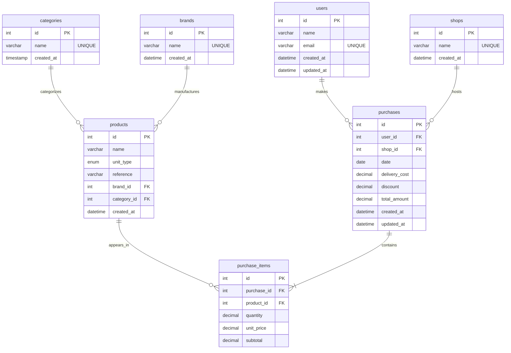

# SmartSpend Database Entity-Relationship Diagram (ERD)

This document visualizes the normalized relational database schema for the SmartSpend application. The schema is designed following a Snowflake architecture, separating transactional data (Facts) from descriptive metadata (Dimensions).

## 📊 Visual ERD (Mermaid)

