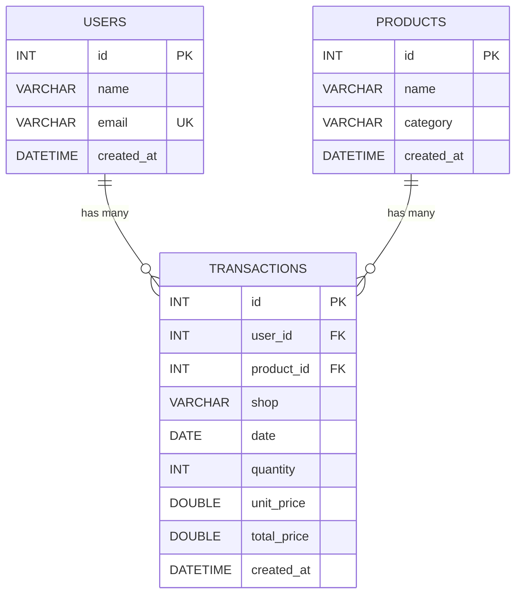

# SmartSpend — Database ERD

```mermaid
erDiagram
    USERS {
        INT id PK
        VARCHAR name
        VARCHAR email UK
        DATETIME created_at
    }

    PRODUCTS {
        INT id PK
        VARCHAR name
        VARCHAR category
        DATETIME created_at
    }

    TRANSACTIONS {
        INT id PK
        INT user_id FK
        INT product_id FK
        VARCHAR shop
        DATE date
        INT quantity
        DOUBLE unit_price
        DOUBLE total_price
        DATETIME created_at
    }

    USERS ||--o{ TRANSACTIONS : "has many"
    PRODUCTS ||--o{ TRANSACTIONS : "has many"
```
