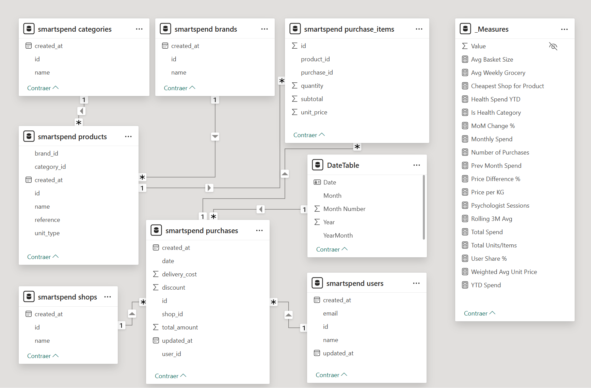
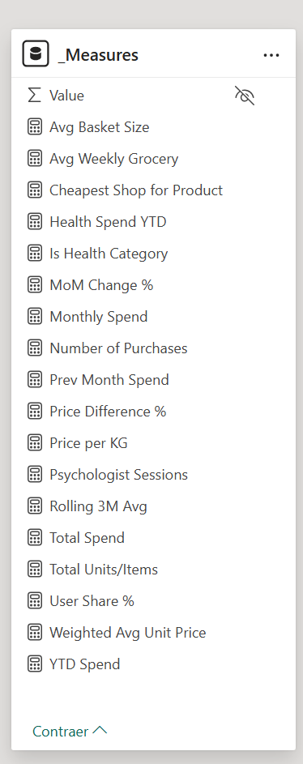

# SmartSpend — Power BI Dashboard Report

> **Project:** SmartSpend — Personal Expense Intelligence Platform
> **Author:** Bunty Nanwani
> **Date:** February 2026

---

## Table of Contents

1. [Introduction](#introduction)
2. [Data Architecture & Relational Model](#data-architecture--relational-model)
3. [DAX Engine & Measures](#dax-engine--measures)
4. [Dashboard Pages & Analytics](#dashboard-pages--analytics)
5. [Technical Notes](#technical-notes)

---

## Introduction

SmartSpend is a full-stack personal expense intelligence platform designed to capture, store, and analyze household spending at the item level. The Power BI layer sits at the top of a three-tier architecture:

User → React Frontend → FastAPI Backend → MySQL Database → Power BI Dashboard

The dashboard transforms raw transactional data into actionable financial insights, serving as a **robust financial tracking and price-inflation analytics tool**. It enables:

* **Granular item-level price tracking** across multiple retail locations over time.  
* **Multi-user household analysis** — comparing spending behavior between family members.  
* **Category and brand-level cost breakdowns** — identifying the most expensive spending categories and detecting hidden cost drivers.  
* **Time-series trend analysis** — revealing weekly, monthly, and seasonal spending patterns.  
* **Vendor comparison** — evaluating shop-wise expenditure distribution to optimize purchasing decisions.

The underlying data model follows a normalized relational schema (Users, Shops, Products, Categories, Brands, Purchases, and PurchaseItems), ensuring Power BI can leverage clean fact/dimension relationships for accurate aggregation, filtering, and drill-through analytics.

---

## **Data Architecture & Relational Model**

### **Snowflake Schema Design**

The Power BI data model implements a **Snowflake schema** — an extension of the classic Star schema where dimension tables are further normalized into sub-dimensions. This design directly mirrors the normalized MySQL backend:

#### **Fact Table**

| Table | Role | Key Columns |
| :---- | :---- | :---- |
| **purchase\_items** | Central fact table | id, purchase\_id (FK), product\_id (FK), quantity, unit\_price, subtotal |

Each row in purchase\_items represents a single line-item on a receipt — one product purchased at a specific quantity and price. All monetary aggregations (total spend, average basket cost, price evolution) originate from this table.

#### **Dimension Tables**

| Table | Role | Key Columns |
| :---- | :---- | :---- |
| **purchases** | Transaction header dimension | id (PK), user\_id (FK), shop\_id (FK), date, delivery\_cost, discount, total\_amount |
| **products** | Product catalogue dimension | id (PK), reference, name, category\_id (FK), brand\_id (FK), unit\_type |
| **users** | User/buyer dimension | id (PK), name, email |
| **shops** | Retail location dimension | id (PK), name |
| **categories** | Product category sub-dimension | id (PK), name |
| **brands** | Product brand sub-dimension | id (PK), name |

#### **Relationship Chain**

Plaintext  
users ──\< purchases ──\< purchase\_items \>── products \>── categories  
                                                    \>── brands  
         shops ──\< purchases

* **purchases → purchase\_items**: One-to-many (one receipt contains multiple line-items).  
* **products → purchase\_items**: One-to-many (one product can appear on many receipts).  
* **users → purchases**: One-to-many (one user makes many purchases).  
* **shops → purchases**: One-to-many (one shop hosts many purchases).  
* **categories → products**: One-to-many (one category contains many products).  
* **brands → products**: One-to-many (one brand covers many products).

#### **Why Snowflake?**

The normalized sub-dimensions (categories and brands branching off products) provide:

1. **Data integrity** — No redundant category/brand strings scattered across product rows.  
2. **Flexible filtering** — Slicers can target category or brand independently.  
3. **Power BI optimization** — Smaller dimension tables compress better in the VertiPaq engine.  
4. **Future extensibility** — Adding brand metadata or category hierarchies requires no schema changes to the fact table.

---

## **DAX Engine & Measures**

The measures layer is the analytical engine of the dashboard. All KPIs and dynamic labels are driven by explicit DAX measures organized into logical groups in the \_Measures table.

### **1\. Core Financials & Basket Analytics**

* **Total Spend**: SUM(purchase\_items\[subtotal\]) \- The absolute total amount of money spent.  
* **YTD Spend**: Cumulative total spent from January 1st of the current year.  
* **Monthly Spend**: The total money spent strictly within the current calendar month.  
* **Number of Purchases**: The total count of distinct shopping trips or receipts.  
* **Total Units/Items**: The physical volume or quantity of items bought.  
* **Avg Basket Size**: The average amount of money spent per individual trip to the store.  
* **Avg Weekly Grocery**: The average amount of money spent specifically on food per week.  
* **User Share %**: The percentage of the total household spending that belongs to one specific user.

### **2\. Advanced Pricing Intelligence**

* **Weighted Avg Unit Price**: DIVIDE(SUM(subtotal), SUM(quantity)) \- The true average cost of an item.  
* **Price per KG**: Scales the unit price up to a full kilogram for easier human analysis.  
* **Cheapest Shop for Product**: A dynamic text engine that evaluates all shops and returns the name of the merchant offering the lowest historical price for a selected item using TOPN.  
* **Price Difference %**: Calculates the inflation or gap between the most expensive shop and the cheapest shop for the same product.

### **3\. Time Intelligence & Health Tracking**

* **Prev Month Spend**: Calculates exactly what was spent in the previous calendar month.  
* **MoM Change %**: The percentage increase or decrease in spending compared to the previous month.  
* **Rolling 3M Avg**: A smoothed-out average of spending over the last 90 days.  
* **Is Health Category**: A logical background flag that filters the dashboard to show only wellness investments.  
* **Health Spend YTD**: The total amount of money invested strictly into physical and mental well-being since January 1st.  
* **Psychologist Sessions**: A specific counter tracking the exact number of clinical therapy appointments attended.

---

## **Dashboard Pages & Analytics**

The Power BI report is organized into **6 interactive pages**, each targeting a specific analytical perspective. All pages share synchronized slicers (date range, user, shop, category) for consistent cross-filtering.

### **Page 1: 🏠 Overview (Executive Summary)**

* **Purpose:** A high-level, 5-second understanding of total financial outflow.  
* **Key Visuals:** Total Spend Over Time (Clustered Column Chart), Expenses Breakdown by Category (Horizontal Bar Chart), and Top Merchants (Summary Table).

### **Page 2: 🛒 Categories & Products**

* **Purpose:** To break down broader categories into specific product-level analytics.  
* **Key Visuals:** Drill-down capabilities from macro categories (Groceries) into specific item costs.

### **Page 3: 🏪 Shop Comparison (Price Tracker)**

* **Purpose:** A dedicated price-tracking tool designed to monitor actual inflation and compare supermarket pricing dynamically.  
* **Key Visuals:** Product Slicer, and a highly detailed Transaction History Table showing exact dates, quantities, and historical prices to see exactly when supermarkets change their rates.

### **Page 4: 👥 User Analysis**

* **Purpose:** To separate and analyze expenses by the individual purchaser.  
* **Key Visuals:** Tracks the financial footprint of the primary user, built on a scalable architecture to accommodate multi-user cost-splitting in the future.

### **Page 5: 📈 Time Intelligence**

* **Purpose:** To analyze the velocity of spending and month-over-month financial momentum.  
* **Key Visuals:** Total Spend Over Time (Area Chart/Wave) and Monthly Spending Flow (Waterfall Chart) showing positive/negative monthly variance.

### **Page 6: 🩺 Health Tracker**

* **Purpose:** A highly specialized page completely isolated from regular expenses, focused entirely on physical and mental well-being.  
* **Key Visuals:** Wellness Investment Breakdown (Horizontal Bar Chart) and a complete chronological ledger of every health-related purchase or clinical visit.

---

## **Technical Notes**

### **Data Refresh**

The Power BI dataset connects directly to the MySQL database configured in backend/.env. The connection uses the same credentials:

| Parameter | Value |
| :---- | :---- |
| Host | DB\_HOST (default: localhost) |
| Port | DB\_PORT (default: 3306) |
| Database | DB\_NAME (default: smartspend) |
| Connector | MySQL ODBC / DirectQuery or Import mode |

### **Schema Dependencies**

The Power BI model depends on the normalized schema defined in:

* database/init.sql — Initial bootstrap script.  
* database/14-02-26-schema.sql — Full normalized schema with constraints.

### **Backend API Alignment**

All entity names and relationships in the Power BI model map 1:1 to the SQLAlchemy ORM models in backend/app/models/:

| Power BI Table | SQLAlchemy Model | File |
| :---- | :---- | :---- |
| users | User | user.py |
| shops | Shop | shop.py |
| products | Product | product.py |
| categories | Category | category.py |
| purchases | Purchase | purchase.py |
| purchase\_items | PurchaseItem | purchase\_item.py |

### **Related Documentation**

* Architecture Overview  
* Database ERD  
* Project Briefing (EN)  
* Project Briefing (ES)

---

*Generated as part of the SmartSpend Personal Expense Intelligence Platform.*

